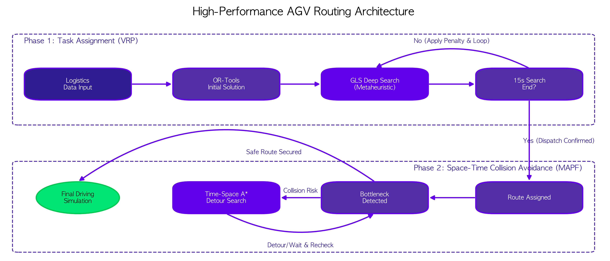
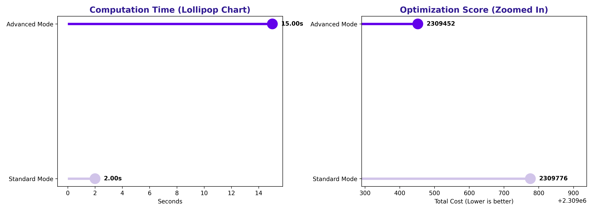
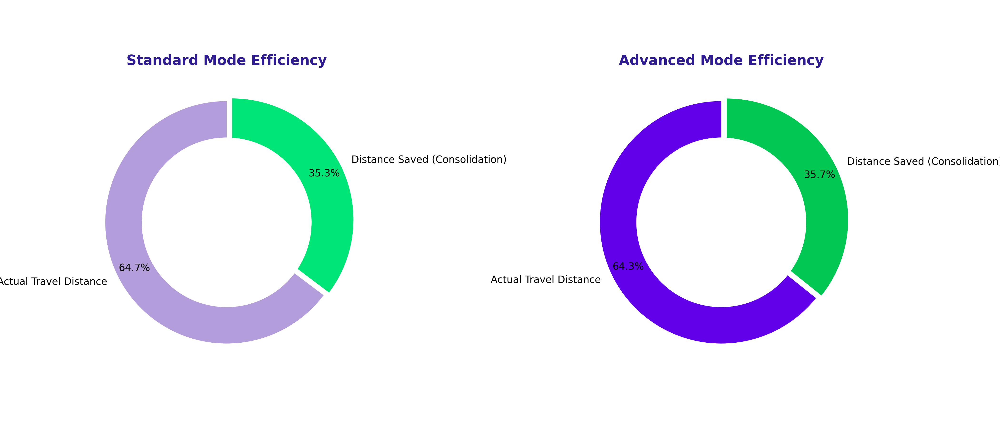
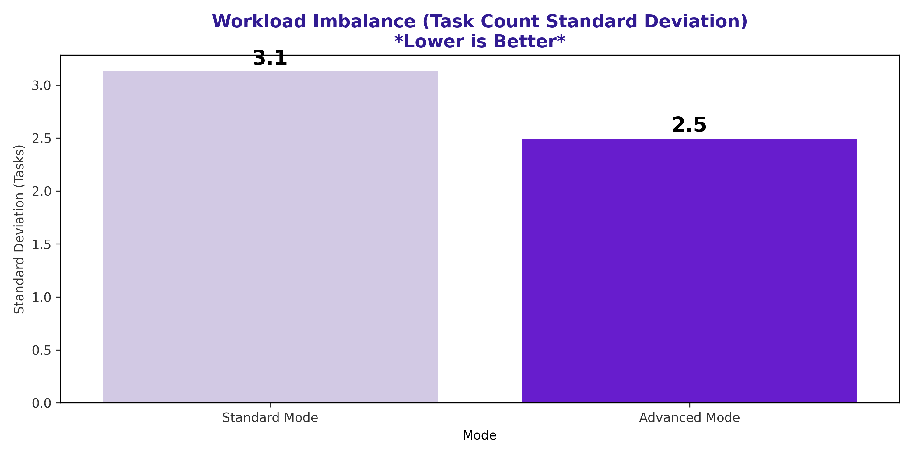
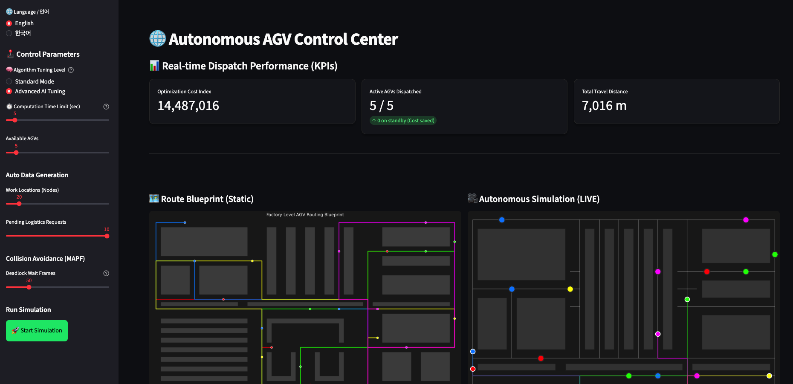
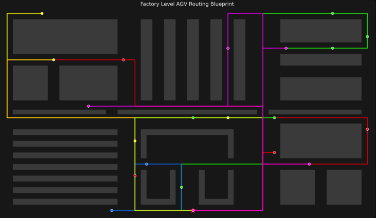
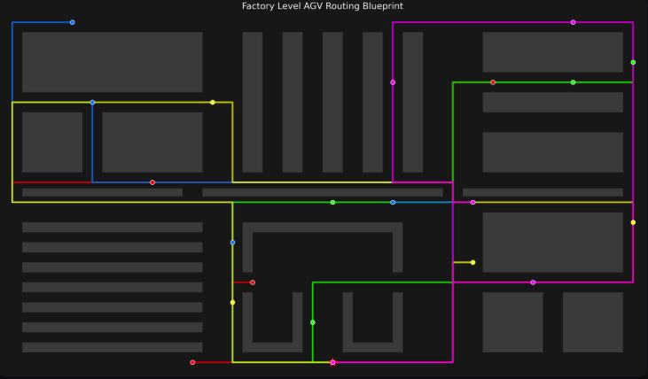

<div align="center">

# 🏭 Smart Factory AGV Routing Optimizer

### _Metaheuristic AI-Powered Large-Scale Autonomous Vehicle Logistics Optimization Simulator_


**100 Nodes · Up to 50 AGVs · Real-Time Collision Avoidance (MAPF) · Web-Based Control Dashboard**

---

</div>

<br>

## 🔍 Overview

This project presents a **full-stack autonomous logistics simulation system** for smart factory environments. It solves the **Vehicle Routing Problem (VRP)** using Google OR-Tools with metaheuristic optimization, and implements **Multi-Agent Pathfinding (MAPF)** to ensure collision-free navigation across a factory floor with obstacles.

The system features a real-time **Streamlit web dashboard** where users can configure factory parameters, select optimization strategies, generate simulated logistics data, and visualize AGV movements — all within a single interactive interface. It supports **bilingual UI (English / Korean)** and offers two distinct optimization modes for comparative analysis.

<br>

## 🎥 Autonomous Simulation (LIVE)

> Multiple AGVs autonomously navigate a factory layout, processing logistics requests in real time.  
> Each robot is color-coded and follows an optimized route while avoiding obstacles (walls) and other agents.

<div align="center">

https://github.com/user-attachments/assets/5f83886b-e175-4764-a319-1dff4307cdb6

</div>

<br>

## 📊 Performance Comparison

This simulator provides two optimization modes: **Standard Mode** and **Advanced AI Tuning Mode**.  
Both modes process identical logistics request data, enabling a fair, quantitative comparison of key performance indicators (KPIs).

### 🔀 Standard Mode vs Advanced Mode

| Metric | Standard Mode | Advanced Mode | Difference |
|:---:|:---:|:---:|:---:|
| **Algorithm** | Greedy Descent | Guided Local Search (GLS) | Metaheuristic Search |
| **Optimization Cost** | 2,309,776 | **2,309,452** | ✅ Lower Cost |
| **Workload Imbalance (σ)** | 3.1 | **2.5** | ✅ 19% More Balanced |
| **Computation Time** | 2s | 15s | ⏱️ Deep Search |

- **Standard Mode**: Generates a feasible routing solution in minimal time. Best suited for real-time operational environments where speed is the top priority. Uses a greedy descent strategy that finds a good-enough solution quickly without iterative refinement.
- **Advanced Mode**: Applies **Guided Local Search (GLS)**, a metaheuristic strategy that escapes local optima by introducing penalty-based perturbations. It invests significantly more computation time (up to 15 seconds) to **minimize the total cost function** and **reduce workload imbalance across AGVs**, ensuring every robot shares the burden more evenly.

<br>

## 🧬 System Architecture

The system is designed as a **Two-Phase Pipeline** architecture, separating task assignment from physical path planning to achieve both optimality and safety.

<p align="center">
  
</p>

### Phase 1: Task Assignment (Vehicle Routing Problem)
1. **Logistics Data Input** — Node coordinates, pickup-delivery request pairs, and obstacle (wall) definitions are loaded or procedurally generated.
2. **OR-Tools Initial Solution** — A greedy heuristic (e.g., PATH_CHEAPEST_ARC) generates a feasible initial routing plan, assigning tasks to each AGV.
3. **GLS Deep Search (Advanced Mode)** — Guided Local Search iteratively refines the solution by penalizing frequently used edges, forcing the solver to explore alternative routes and escape local minima.
4. **Dispatch Confirmed** — The best solution found within the time limit is locked in as the final routing plan for all AGVs.

### Phase 2: Space-Time Collision Avoidance (MAPF)
1. **Route Assignment** — Each AGV's node visit sequence from Phase 1 is converted into a concrete grid-level path on the factory floor.
2. **Bottleneck Detection** — The system scans for spatial-temporal conflicts where two or more AGVs attempt to occupy the same cell at the same timestep.
3. **Time-Space A\* Detour Search** — When a collision risk is detected, a Time-Space A\* algorithm searches for alternative paths or introduces wait states to resolve conflicts without deadlocks.
4. **Final Driving Simulation** — Once all conflicts are resolved, the system produces a smooth, collision-free animation of all AGVs executing their routes simultaneously.

### 📈 Computation Time & Optimization Cost

<p align="center">
  
</p>

> Advanced Mode performs a 15-second deep search, achieving a **lower total cost index** compared to Standard Mode. The additional computation time is invested in iterative metaheuristic refinement.

### 🍩 Route Efficiency Comparison

<p align="center">
  
</p>

> Both modes achieve approximately **35% distance savings (consolidation)** compared to naive straight-line routing. Advanced Mode shows marginally higher efficiency due to deeper optimization.

### 📊 Workload Imbalance (Task Count Standard Deviation)

<p align="center">
  
</p>

> Advanced Mode reduces the task count standard deviation from **3.1 → 2.5 (≈19% improvement)**, effectively mitigating scenarios where specific AGVs are overloaded while others remain idle.

<br>

## 🖥️ Web-Based Control Dashboard

A real-time interactive dashboard built with Streamlit, providing a single interface for parameter tuning, simulation execution, KPI monitoring, and route visualization.

<p align="center">
  
</p>

**Key Features:**
- 🌐 **Bilingual Support** — Seamless real-time switching between English and Korean
- 🧠 **Algorithm Mode Selection** — Toggle between Standard and Advanced AI Tuning
- ⏱️ **Computation Time Control** — Adjustable from 1 to 60 seconds
- 🚛 **Fleet Size Configuration** — Deploy up to 50 AGVs simultaneously
- 📍 **Dynamic Data Generation** — Procedurally generate up to 100 work nodes and logistics requests
- 💥 **MAPF Collision Avoidance** — Configurable deadlock timeout threshold


## 🗺️ Route Blueprint Comparison

Optimized routes for each AGV visualized on the actual factory layout, including obstacles and wall structures.

<table align="center">
  <tr>
    <td align="center"><b>🟢 Standard Mode</b></td>
    <td align="center"><b>🟣 Advanced Mode</b></td>
  </tr>
  <tr>
    <td></td>
    <td></td>
  </tr>
  <tr>
    <td align="center"><i>Fast computation, practical routes</i></td>
    <td align="center"><i>Deep search, maximum optimization</i></td>
  </tr>
</table>

<br>

## 📂 Project Structure

```
smart-factory-agv-routing-optimizer/
├── app.py                  # Streamlit web dashboard (main entry point)
├── agv_routing.py          # OR-Tools VRP solver + MAPF collision avoidance + visualization engine
├── data_generator.py       # Procedural factory data generator (nodes, requests, walls)
└── visualization/          # Visualization assets
    ├── sim.mp4                 # Autonomous driving simulation video
    ├── sim_screen.png          # Control dashboard screenshot
    ├── architecture.png        # System architecture diagram
    ├── route_standard.png      # Standard mode routing blueprint
    ├── route_advanced.png      # Advanced mode routing blueprint
    ├── donut_bar_charts.png    # Route efficiency donut charts
    ├── donut_bar_charts_1.png  # Workload imbalance bar chart
    ├── lollipop_chart.png      # Computation time & cost lollipop chart
    └── agv_performance.ipynb   # Performance analysis Jupyter Notebook
```

<br>

## 🚀 Getting Started

### 1. Install Dependencies

```bash
pip install ortools streamlit pandas matplotlib numpy pillow
```

### 2. Launch the Simulator

```bash
cd smart-factory-agv-routing-optimizer
streamlit run app.py
```

Open `http://localhost:8501` in your browser to access the control dashboard.

### 3. Run the Performance Analysis Notebook

```bash
jupyter notebook visualization/agv_performance.ipynb
```

<br>

## 🛠️ Tech Stack

| Category | Technology |
|:---:|:---|
| **Optimization Engine** | Google OR-Tools (CP-SAT / VRP Solver) |
| **Metaheuristic** | Guided Local Search (GLS), Greedy Descent |
| **Collision Avoidance** | Multi-Agent Pathfinding (MAPF), Time-Space A* |
| **Web Framework** | Streamlit |
| **Visualization** | Matplotlib, Pillow (GIF Rendering) |
| **Data Processing** | Pandas, NumPy |
| **Language** | Python 3.10+ |

<br>

## 📚 References & Data Sources

### Optimization Models

| Reference | Description |
|:---|:---|
| [Google OR-Tools — Vehicle Routing Problem (VRP)](https://developers.google.com/optimization/routing) | The core solver of this project. Google's open-source optimization library supporting various VRP variants including Capacity Constraints, Pickup & Delivery, and Time Windows. |
| [Google OR-Tools — Guided Local Search (GLS)](https://developers.google.com/optimization/routing/routing_options#local_search_options) | The metaheuristic strategy used in Advanced Mode. Prevents the solver from getting trapped in local optima by applying penalty-based escape mechanisms to explored solutions. |
| [Multi-Agent Pathfinding (MAPF) — Overview](https://mapf.info/) | Theoretical background on finding collision-free paths for multiple agents navigating a shared environment simultaneously. |
| [Stern, R. et al. — "Multi-Agent Pathfinding: Definitions, Variants, and Benchmarks" (2019)](https://ojs.aaai.org/index.php/SOCS/article/view/18510) | A comprehensive survey paper that systematically defines MAPF problem variants and benchmarks. Serves as the theoretical foundation for the Phase 2 collision avoidance logic. |

### Data Generation

| Item | Description |
|:---|:---|
| **Factory Layout** | Procedurally generated by `data_generator.py`. Node coordinates, obstacle (wall) structures, and logistics requests (pickup-delivery pairs) are freshly generated each run using random seeds, simulating realistic corridor-workstation placement patterns found in manufacturing facilities. |
| **Distance Matrix** | Computed using Manhattan Distance between each node pair, accounting for obstacle-aware pathfinding to produce accurate travel cost estimates. |
| **Logistics Requests** | Randomly selected pickup-delivery pairs from generated nodes. The number of requests is dynamically adjustable through the dashboard interface. |

### Additional Resources

- [Google OR-Tools GitHub Repository](https://github.com/google/or-tools) — Source code and examples
- [Streamlit Documentation](https://docs.streamlit.io/) — Official web dashboard framework documentation
- [A* Search Algorithm — Wikipedia](https://en.wikipedia.org/wiki/A*_search_algorithm) — Theoretical background of the A* algorithm used in Phase 2 detour pathfinding

<br>

<div align="center">

---

**Made with 🤖 by Gyumin Kang**

*Designing the future of smart factories through code.*

</div>
